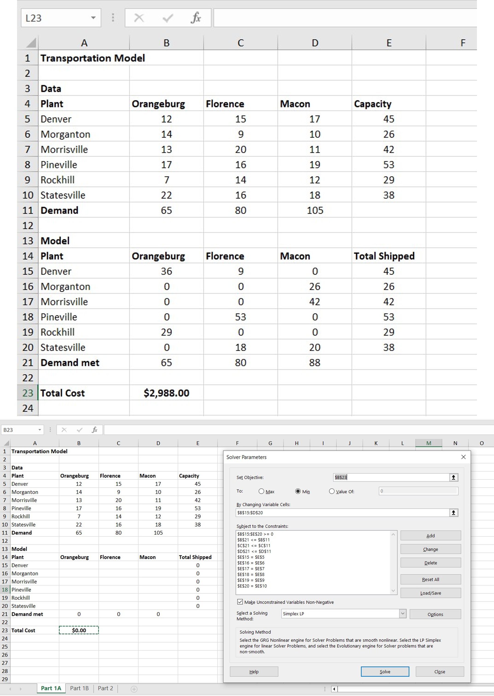
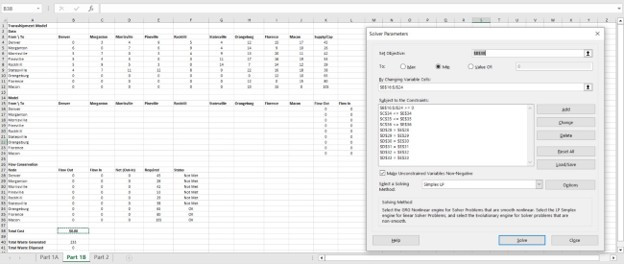
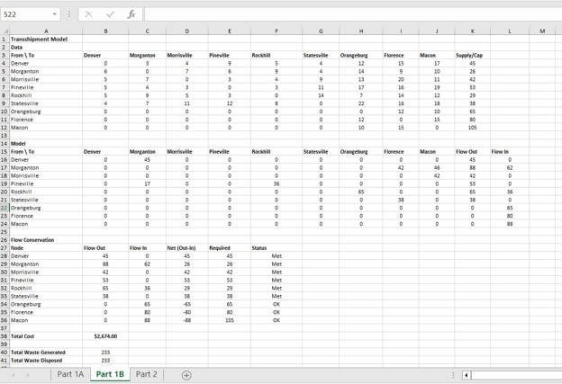
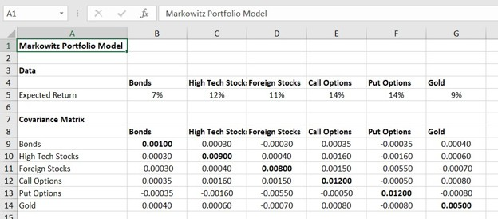
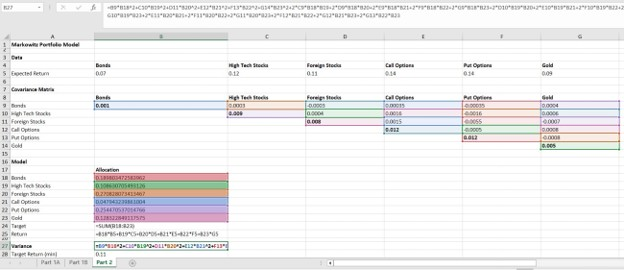
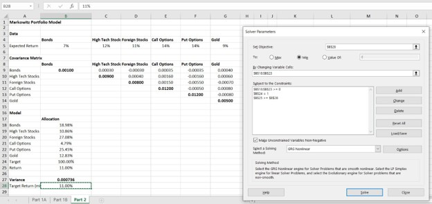
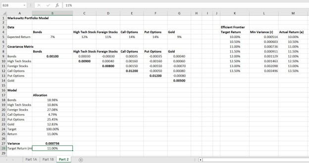
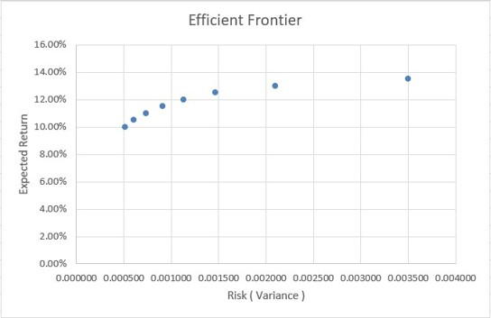

# Excel Solver Optimization: Transshipment and Portfolio Models

Two constrained optimization problems built and solved in Excel Solver: a linear programming model minimizing hazardous waste shipping costs, and a nonlinear Markowitz model minimizing portfolio variance subject to a return floor. Includes an efficient frontier traced across eight return targets.

**Tools:** Microsoft Excel, Solver (Simplex LP and GRG Nonlinear), SUMPRODUCT, scatter charts

> **Team project.** Built as a group assignment for a graduate enterprise analytics course with Masoud Aghaei Navasatli. My contribution: _[which parts you owned]_. Published with my teammate's agreement.

---

## Problem 1: Waste Transportation (Linear Programming)

A shipping company must move chemical waste from six plants to three disposal sites at minimum cost. Two formulations were built and compared.

### Part 1A: Direct shipping

An 18-cell decision variable table (6 plants x 3 sites) with cost per barrel in the data section above it.

| Component | Cell reference | Formula |
|---|---|---|
| Total cost (objective) | `$B$23` | `=SUMPRODUCT(B15:D20, B5:D10)` |
| Barrels shipped per plant | `E15:E20` | `=SUM(B15:D15)` |
| Barrels received per site | `B21:D21` | `=SUM(B15:B20)` |

**Solver setup:** minimize `$B$23`, changing `B15:D20`, method Simplex LP.

Constraints:
- All waste shipped: `E15:E20 = E5:E10`
- Site capacity not exceeded: `B21:D21 <= B11:D11`
- Non-negativity: `B15:D20 >= 0`

**Result: $2,988 per week.** All 233 barrels generated are shipped. Orangeburg and Florence run at full capacity (65 and 80 barrels); Macon absorbs 88 against a 105-barrel limit.



### Part 1B: Transshipment

The same problem reformulated to allow routing through intermediate nodes. The decision variable table expands to 9x9, covering every possible route among the nine nodes, including plant-to-plant and site-to-site legs. Flow conservation replaces the simple supply constraint: for each plant, flow out minus flow in must equal its own supply.

| Component | Cell reference | Formula |
|---|---|---|
| Total cost (objective) | `$B$38` | `=SUMPRODUCT(B16:J24, B4:J12)` |
| Net flow per node | `D28:D33` | `=FlowOut - FlowIn` |

**Solver setup:** minimize `$B$38`, changing `B16:J24`, method Simplex LP.

Constraints:
- Flow conservation at plants: `D28:D33 = E28:E33`
- Site capacity: `C34:C36 <= E34:E36`
- Non-negativity: `B16:J24 >= 0`



**Result: $2,674 per week, a saving of $314 (10.5%) against direct shipping.**



Optimal routes:

| From | To | Barrels |
|---|---|---|
| Denver | Morganton | 45 |
| Morganton | Florence | 42 |
| Morganton | Macon | 46 |
| Morrisville | Macon | 42 |
| Pineville | Morganton | 17 |
| Pineville | Rockhill | 36 |
| Rockhill | Orangeburg | 65 |
| Statesville | Florence | 38 |

The saving comes from consolidation. Denver sends its full 45 barrels to Morganton rather than paying for three separate long hauls, and Morganton then forwards a combined load to Florence and Macon. Rockhill performs the same role for Pineville's waste before shipping 65 barrels to Orangeburg in one movement. Total barrels carried is 331 across all legs, higher than the 233 generated, because transshipped waste is counted on each leg it travels.

## Problem 2: Markowitz Portfolio Optimization (Nonlinear)

Minimize portfolio variance across six asset classes subject to a minimum expected return of 11%, using the full 6x6 variance-covariance matrix.



**Objective formula** (portfolio variance, `B27`), expanding the quadratic form to include all fifteen covariance cross-terms:

```excel
=B9*B18^2+C10*B19^2+D11*B20^2+E12*B21^2+F13*B22^2+G14*B23^2
+2*C9*B18*B19+2*D9*B18*B20+2*E9*B18*B21+2*F9*B18*B22+2*G9*B18*B23
+2*D10*B19*B20+2*E10*B19*B21+2*F10*B19*B22+2*G10*B19*B23
+2*E11*B20*B21+2*F11*B20*B22+2*G11*B20*B23
+2*F12*B21*B22+2*G12*B21*B23+2*G13*B22*B23
```

**Portfolio return** (`B25`): `=B18*B5+B19*C5+B20*D5+B21*E5+B22*F5+B23*G5`



**Solver setup:** minimize `$B$27`, changing `B18:B23`, method GRG Nonlinear.

Constraints:
- Fully invested: `B24 = 1`
- Return floor: `B25 >= B28`
- Long only: `B18:B23 >= 0`

**Result: minimum variance of 0.000736 at exactly 11.00% return.**



| Asset | Expected return | Optimal allocation |
|---|---|---|
| Foreign Stocks | 11% | 27.08% |
| Put Options | 14% | 25.45% |
| Bonds | 7% | 18.98% |
| Gold | 9% | 12.83% |
| High Tech Stocks | 12% | 10.86% |
| Call Options | 14% | 4.79% |

The counterintuitive result is worth noting: Call Options and Put Options carry identical 14% expected returns and identical 0.012 variances, yet the model allocates 25.45% to one and 4.79% to the other. The difference is entirely covariance. Put Options correlate negatively with Bonds, Foreign Stocks, and Gold, so they reduce total portfolio variance despite their own high individual risk. Call Options correlate positively across the board. This is the core Markowitz insight, that an asset's contribution to risk depends on how it moves relative to everything else rather than on its standalone volatility.

### Efficient Frontier

Solver was re-run across eight target returns to trace the risk-return boundary.

| Target return | Minimum variance |
|---|---|
| 10.0% | 0.000514 |
| 10.5% | 0.000603 |
| 11.0% | 0.000736 |
| 11.5% | 0.000911 |
| 12.0% | 0.001129 |
| 12.5% | 0.001463 |
| 13.0% | 0.002098 |
| 13.5% | 0.003496 |





The curve is convex. Moving from 10% to 10.5% return costs 0.000089 in added variance; moving from 13% to 13.5% costs 0.001398, roughly sixteen times as much for the same half point of return. Risk does not scale linearly with ambition, and the penalty accelerates sharply at the upper end.

For a highly risk-averse investor, the 10% target at 0.000514 variance is the defensible choice.

## Files

| File | Purpose |
|---|---|
| `optimization_models.xlsx` | Workbook with three sheets: Part 1A, Part 1B, Part 2 |
| `*.png`, `*.jpg` | Screenshots of model layouts, Solver dialogs, and the efficient frontier chart |

## Verification

The transshipment solution reconciles against its constraints. Morganton's flow out of 88 barrels less flow in of 62 equals its 26-barrel supply. Orangeburg and Florence receive exactly their capacity, and Macon's 88 barrels sit within its 105 limit. Total disposed equals total generated at 233 barrels.

## Notes and Possible Improvements

- **The variance formula is written out longhand.** All fifteen covariance terms are typed explicitly, which works but does not scale and is difficult to audit. The matrix form `=MMULT(TRANSPOSE(B18:B23), MMULT(B9:G14, B18:B23))` produces the same result in one expression and extends to any number of assets without rewriting.
- **Sensitivity analysis reports allocation shifts that are not tabulated.** The write-up describes bonds giving way to higher-yielding assets as the return target rises, but only the 11% allocation is shown. Recording the full allocation vector at each of the eight target returns would make that claim verifiable and would let the shift be charted.
- **Expected returns and covariances are given, not estimated.** In practice both would be estimated from historical price data and carry substantial uncertainty, which mean-variance optimization is notoriously sensitive to. Small changes in the inputs can move the optimal weights considerably.
- **No short selling and no transaction costs.** The long-only constraint and the absence of trading friction both simplify the problem relative to a real mandate.
